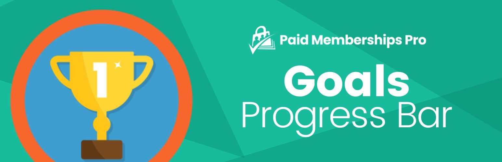

# [Paid Memberships Pro - Goals Progress Bar](https://www.paidmembershipspro.com/add-ons/pmpro-goals/) #

### Welcome to the Paid Memberships Pro - Goals Progress Bar GitHub Repository
Create a dynamic progress bar that can be used in your posts, pages or widgets. Each progress bar offers unique settings to customize the appearance and the target, including which membership levels to count in the total goal progress calculation.

After installing and activating the plugin, you will be able to add a new Goal Progress Bar via a shortcode or Block (if you are using the Block Editor as part of WordPress v5.0+).

For more information please visit [paidmembershipspro.com/add-ons/pmpro-goals/](https://www.paidmembershipspro.com/add-ons/pmpro-goals/)

## Installation ##
For detailed installation steps, visit the [documentation](https://www.paidmembershipspro.com/add-ons/pmpro-goals/) page.

1. Download the current development ZIP file directly: `https://github.com/strangerstudios/pmpro-goals/archive/dev.zip`

**Please ensure that once installing this version of the plugin to remove `-dev` from the plugin's folder name.**

## Bugs ##
If you find an issue/bug, let us know by [creating a detailed GitHub issue](https://github.com/strangerstudios/pmpro-goals/issues/new).

## Support ##
This is a developer's portal for Paid Memberships Pro - Goals Progress Bar. We do not offer support on this channel. **Any support related questions should be directed to [paidmembershipspro.com/add-ons/pmpro-goals/](https://www.paidmembershipspro.com/add-ons/pmpro-goals/).**

## Contributing to Paid Memberships Pro - Goals Progress Bar ##
We encourage and welcome any contribution to Paid Memberships Pro - Goals Progress Bar. Please read the [guidelines for contributing](https://github.com/strangerstudios/pmpro-goals/blob/dev/.github/CONTRIBUTING.md) to this repository.

There are various **ways to the help development** of Paid Memberships Pro - Goals Progress Bar:

1. Report [bugs/issues](https://github.com/strangerstudios/pmpro-goals/issues/new) on GitHub.
2. Work on any issues by submitting a Pull Request.

Here are some ways for **non-developers to contribute** to Paid Memberships Pro - Goals Progress Bar:

1. Translate Paid Memberships Pro - Goals Progress Bar into your own [language](https://www.paidmembershipspro.com/paid-memberships-pro-in-your-language/).
2. [Purchase a paid membership](https://paidmembershipspro.com/pricing) to help fund ongoing development and bug fixes.